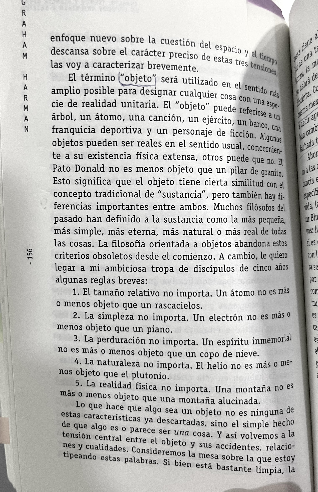

# Clase 01

## Apuntes de clase

* Con signo de asterisco se hacen listas
* Con signo de asterisco se hacen listas
* Con signo de asterisco se hacen listas
* Cuando encierro una palabra entre **dos asteriscos, genero una negrita**

## Mi primera imagen

```md
///En la sintaxis hay que incluir
///signo de exclamación
///paréntesis cuadrado con texto alternativo
///paréntesis redondo con dirección de imagen
/// el punto-slash indica que la busque en esta misma carpeta

```


Se puede agregar la foto de un perro arrastrando, pero es mejor evitarlo


Test de un gif. A Manuel no le funcionaba porque el archivo de origen tenía un espacio.


## Sobre objeto para Harman



## Encargo para clase02

* Analizar las obras de Mateo Cereceda y Gabriela Inostroza según el punto de vista de la Ontología Orientada a Objetos y el concepto de metáfora.

* Elegir dos objetos. Sacar una foto  y mencionar 10 cualidades de cada uno. Como tip, para encontrar propiedades más interesantes, se sugiere nombrar las diez, luego escribir otras diez, y desechar las primeras

No obligatorio: en [../../archivos/](../../archivos/ortega-ensayo-de-estetica-a-manera-de-prologo_compress-1.pdf) encontrarén el texto "Ensayo de estética a modo de prólogo"